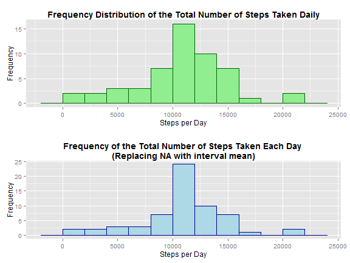

The advent of the personal activity monitoring device enables a better understanding of an individual's behaviour. For example, one individuals steps where recorded at 5-minute interval during October 2012 through November 2012. The resulting dataset is available at <https://d396qusza40orc.cloudfront.net/repdata%2Fdata%2Factivity.zip>.

To better understand this data, load it into R and take advantage of its capabilities.


```r
library(ggplot2)
library(gridExtra)

# load the data
stepsData <- read.csv("activity.csv", header=TRUE)

# process the data
stepsPerDay <- aggregate(steps ~ date, data=stepsData, sum)
stepsPerIntervalMean <- aggregate(steps ~ interval, data=stepsData, mean)
```

Generating a histogram of the total number of steps taken each day, gives an approximately normal distribution.


```r
# generate histogram (graphical representation of the distribution of data) of the total number of steps taken each day
# generate histogram (graphical representation of the distribution of data) of the total number of steps taken each day
plot1 = ggplot(data=stepsPerDay, aes(x=steps)) 
plot1 = plot1 + geom_histogram(colour="darkgreen", fill="lightgreen", binwidth=2000)
plot1 = plot1 + ggtitle("Frequency Distribution of the Total Number of Steps Taken Daily")
plot1 = plot1 + theme(plot.title = element_text(face="bold"))
plot1 = plot1 + xlab("Steps per Day") + ylab("Frequency")
plot1
```

 

Given the frequency distribution appears normal, one would expect the mean and median to be relatively equal.


```r
# calculate the mean/median total number of steps taken per day
options(scipen=999)
stepsPerDayMean <- round(mean(stepsPerDay$steps))
stepsPerDaySD <- round(sd(stepsPerDay$steps))
stepsPerDayMedian <- median(stepsPerDay$steps)
```

The mean value for steps per day is 10766 with a standard deviation of 4269. The median value is 10765. So yes, the mean and median are relatively equal.

Now let us study some time interval level data. Calculating the mean for each time interval provides some idea of the distribution of steps over the course of the day.


```r
# time series plot of the 5 minute interval (x-axis) and the average number of steps taken, averages across all days (y-axis)
plot = ggplot(data=stepsPerIntervalMean, aes(interval, steps)) 
plot = plot + geom_line(colour="blue", size=1) 
plot = plot + ggtitle("Average Number of Steps Taken per 5-minute Interval")
plot = plot + theme(plot.title = element_text(face="bold"))
plot = plot + xlab("Time Interval") + ylab("Number of Steps")
plot
```

 


```r
# calculate the 5 minute interval that on average across all the days in the dataset contains the maximum number of steps
interalWithMostSteps <- stepsPerIntervalMean[stepsPerIntervalMean$steps==max(stepsPerIntervalMean$steps),"interval"]
```

The time interval with highest mean number of steps (that peak between 500 and 1000) is 835. 


```r
# calculate and report the total number of missing values (total number of rows with NA)
numberOfNAs <- sum(is.na(stepsData$steps))
```

Unfortunately, the dataset contains 2304 NAs. If we use a very simple strategy of replacing the NAs with the mean for that time interval, will make it a difference?


```r
# replace NA with time interval mean
stepsDataMean <- read.csv("activity.csv", header=TRUE)
for (i in 1:nrow(stepsDataMean)) {
        if(is.na(stepsDataMean$steps[i])==TRUE) {
                stepsDataMean$steps[i] <- stepsPerIntervalMean$steps[stepsPerIntervalMean$interval == stepsDataMean$interval[i]]
        }
}
```


```r
# generate histogram (graphical representation of the distribution of data) of the total number of steps taken each day
stepsPerDay <- aggregate(steps ~ date, data=stepsDataMean, sum)
plot2 = ggplot(data=stepsPerDay, aes(x=steps)) 
plot2 = plot2 + geom_histogram(colour="darkblue", fill="lightblue", binwidth=2000)
plot2 = plot2 + ggtitle("Frequency of the Total Number of Steps Taken Each Day \n(Replacing NA with interval mean)")
plot2 = plot2 + theme(plot.title = element_text(face="bold"))
plot2 = plot2 + xlab("Steps per Day") + ylab("Frequency")
plot2
```

 


A quick comparison of the two histograms, the first with the NAs, the second without the NAs and the mean for that time interval instead.


```r
grid.arrange(plot1, plot2)
```

 

The removeal of the datapoints narrows the distribution as represented by the mean and standard deviation.


```r
# calculate the mean/median total number of steps taken per day
stepsPerDayMeanNAsRemoved <- round(mean(stepsPerDay$steps))
stepsPerDaySDNAsRemoved <- round(sd(stepsPerDay$steps))
stepsPerDayMedianNAsRemoved <- round(median(stepsPerDay$steps))
```

Recall, the mean value for steps per day is 10766 with a standard deviation of 4269 for the dataset with NAs. After the replacements of the NAs, the mean value for steps per day is 10766 with a standard deviation of 3974. The median value is 10766.

Does this person display different behaviours during the week than on the weekend? 


```r
# create a new factor variable in the dataset with two levels - "weekday" and "weekend" indicating whether a given data is a weekday or weekend day
# opting to the mean as the imputation of choice
stepsDataMean$day <- weekdays(as.Date(stepsDataMean$date))
stepsDataMean$dayClassification <- ifelse(stepsDataMean$day=="Saturday" | stepsDataMean$day=="Sunday", "weekend", "weekday")

stepsPerIntervalMeanWeekday <- aggregate(steps ~ interval, data=subset(stepsDataMean,dayClassification=="weekday"), mean)
stepsPerIntervalMeanWeekend <- aggregate(steps ~ interval, data=subset(stepsDataMean,dayClassification=="weekend"), mean)
```


```r
plotWeekday = ggplot(data=stepsPerIntervalMeanWeekday, aes(x=interval,y=steps)) 
plotWeekday = plotWeekday + geom_line(colour="darkblue")
plotWeekday = plotWeekday + ggtitle("Weekday Mean Steps Per Interval")
plotWeekday = plotWeekday + theme(plot.title = element_text(face="bold"))
plotWeekday = plotWeekday + xlab("Time Interval") + ylab("Number of Steps")

plotWeekend = ggplot(data=stepsPerIntervalMeanWeekend, aes(x=interval,y=steps)) 
plotWeekend = plotWeekend + geom_line(colour="darkblue")
plotWeekend = plotWeekend + ggtitle("Weekend Mean Steps Per Interval")
plotWeekend = plotWeekend + theme(plot.title = element_text(face="bold"))
plotWeekend = plotWeekend + xlab("Time Interval") + ylab("Number of Steps")

grid.arrange(plotWeekday, plotWeekend)
```

 

Most certainly yes. The steps start and end later in the day on a weekend day. 
